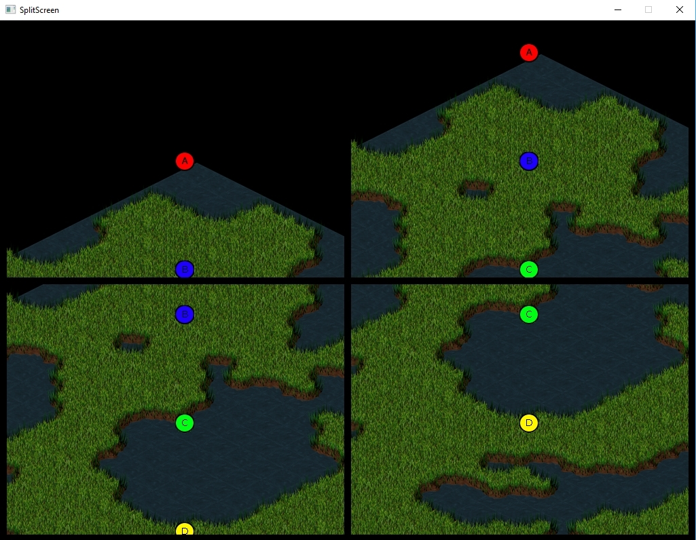

I am <link to your linkedIn>(Jorge Gemas), student of the
<https://www.citm.upc.edu/ing/estudis/graus-videojocs/>(Bachelor’s Degree in
Video Games by UPC at CITM). This content is generated for the second year’s
subject Project 2, under supervision of lecturer
<https://es.linkedin.com/in/ricardpillosu>(Ricard Pillosu).


# Split Screen
A split screen is a software program with the capacity of split X times their window with a horizontal or vertical orientation. The objective to do that, is that the user or player can view different areas of the same or other softwares at the same time.

## When we need a split screen?
it's an option to implement when we have multiple primary focus points that we need to have them at the same time on the screen and under control. Some exemples in the field of software, can be any 3D modeling program. In video games field, the common case is a game with local multiplayer, but not all local multiplayer games needs a split screen.If the players can not separate from each other and leave the screen on the stage or something else, you can search for an alternative in split screen. Som exemples of that, is games like *overcoocked* or *Cuphead*, that the players can not go out off the screen. An example of local multiplayer games that need a split screen is a any game of racing games or shooter when the player need the control of their character and camera.

## Alternatives to the split screen
Depending of the game, we don't need to implement a split screen, we can take an alternative that fulfills the function we need. Here are some alternatives and their advantages and disadvantages and of the split screen as well.

**The screen blocks the player if he tries to pass it.**
This is the tipically option that the games do when they don't want to imlement a split screen. Games like *Wizard of Legends* or "Unravel" that wants the players to stay together, blocking the option to separate.

**Players can move off the screen.**
Terrible option. The player can go off the screen and he can not see where he are. Practically no game uses this option.

**Kill the player if he tries to pass the screen.**
Radical option. Only usefull in games that we want to punish the player in this case. Competitive figthing games like *Smash Bros* implement this option because the objective is to avoid leaving the map and throwing the opponent. In general cases, its so frustrant to the player.

**Teleport the player to the group.**
At least, we don't kill the player, but it feels frustraiting too, and continues to affect gameplay of players like the previous ones.

**The player can drag the screen and the other players.**
If the player is pushing an edge of the screen, he are dragging the screen and the rest of the players. This option continues to affect the player's gameplay, but not only the player's own gameplay, but also the rest of the players. 

**Zoom out to keep players inside the screen.**
In this option, the camera does a zoom out when the players move away from each other up to a limit to keeo the player inside the screen, but it don't resolve the problems.

**Split screen**
If we choose this option, we resolve the previous problems and we aren't affecting the gameplay of the players, but we get another problems. We can give to each player their own camera and the total control of it, but each player are loosing a 50% or 75% of the screen depending if their are 2,3 or 4 players. In general, any game in first person with local multiplayer need a spllit scren because each player need to have their own camera. Another problem is the large amount of resources we spend on the split screen, because it is necessary to paint 4 (in a split screen with 4 players) times, one for each camera. This is one of the most important reasons why the split screen is not used in this days. 

in most cases in local multiplayer games, more exactly in cooperative games, most of the time the players are together, and we are 
spending a lot of resources needlessly. If we have this situation, we can imeplement the Voronoi split screen.

## Voronoi Split Screen
In the Voronoi split screen, when the players are together, the screen is not splitted But at the moment when the players are outside the range of the camera, the screen is splitted by the perpendicular of the line that joins them, indicating the direction of where the other players are. With this, when the players are together, we are not spending unnecessary resources and we are not limiting the size of their screen because they share the same camera until they separate. Some games are using Voronoi with 2 players, for example some games of the saga "*Lego*" like *LEGO Marvel Super Heroes*.


With two players, Voronoi works pretty well. But when we add 4 players in total its a little bit caothic, because all cameras are moving between their and changing their position or mergering between each other, and the size of each camera is different. The forms of the each camera is different too and strange, causing confusion to the players. Personally, i don't recommend to use Voronoi with more than 2 players. Practically, no game is using Voronoi with more than 2 players.

## Games that create new windows
Some games have multiple primary focus points, but no have a local multiplayer mode. in this cases, this games can create new windows with their own camera, to see the primary focus points that the player want to see. This games don't need a split screen and they can select what point want to have consider and how many wants. they are usually management games, and example is a old game named *Transport Tycoon*.

## Important changes (code)
now we have a new class Camera, and is not only a rect. This class have the function to set the pos of the camera following the player. The screen_section is the rect with the position of each camera in the screen and the bool assigned is a bool that turns in true if the camera has been assigned to a player.

```
Camera::Camera()
{
	lerp_factor = 5.f;
}


void Camera::FollowPlayer(float dt, Obj_Player * player)
{
	fPoint source_pos((float) rect.x, (float)rect.y);
	fPoint target_pos (player->pos_screen.x * App->win->GetScale() - rect.w * 0.5f, player->pos_screen.y* App->win->GetScale() - rect.h * 0.5f);

	fPoint lerp_pos = lerp(source_pos, target_pos, dt * lerp_factor);

	rect.x = lerp_pos.x;
	rect.y = lerp_pos.y;
}
```

Now, for each blit we have to do a for with all cameras to pass the current camera to the blit:

```
bool j1Map::PostUpdate()
{
	if(map_loaded == false)
		return false; 

	
	for (std::vector<Camera*>::iterator item_cam = App->render->cameras.begin(); item_cam != App->render->cameras.end(); ++item_cam)
	{
		SDL_RenderSetClipRect(App->render->renderer, &(*item_cam)->screen_section);

		for (std::list<MapLayer*>::iterator item = data.layers.begin(); item != data.layers.end(); ++item)
		{
			MapLayer* layer = *item;

			if (layer->properties.Get("Nodraw") != 0)
				continue;

			for (int y = 0; y < data.height; ++y)
			{
				for (int x = 0; x < data.width; ++x)
				{
					int tile_id = layer->Get(x, y);
					if (tile_id > 0)
					{
						
						TileSet* tileset = GetTilesetFromTileId(tile_id);

						SDL_Rect r = tileset->GetTileRect(tile_id);
						iPoint pos = MapToScreenI(x, y);

						if (App->render->IsOnCamera(pos.x, pos.y, data.tile_width, data.tile_height+32, (*item_cam)))
						{
							App->render->Blit(tileset->texture, pos.x, pos.y, (*item_cam), &r);
						}
					}
				}
			}
		}
		SDL_RenderSetClipRect(App->render->renderer, nullptr);

	}

	return true;
}
```

```
bool j1ObjManager::PostUpdate()
{
	for (std::vector<Camera*>::iterator item_cam = App->render->cameras.begin(); item_cam != App->render->cameras.end(); ++item_cam)
	{
		SDL_RenderSetClipRect(App->render->renderer, &(*item_cam)->screen_section);
		
		for (std::list<Object*>::iterator item = objects.begin(); item != objects.end(); ++item)
		{
			(*item)->Draw(*item_cam);
		}
    }
	SDL_RenderSetClipRect(App->render->renderer, nullptr);
   
	return true;
}
```
In Draw functions, ecery object do a blit with this camera.

# Exercises with their solution

### TODO 0: 
Set the values in config to have 4 cameras. You don't need to modify n_cameras_aux for now…

Calculate the max number of cameras in n_cameras_max with n_cameras_columns and n_cameras_rows.

### Solution:
```
  <n_cameras_columns value="2"/>
  <n_cameras_rows value="2"/>
  <n_cameras_aux value="0"/>
  <orientation value="1"/>
```
```
  case ORIENTATION::SQUARE_ORDER:
		n_cameras_max = n_cameras_columns * n_cameras_rows;										//Calcule the max number of cameras in this case.
		n_cameras_aux = 0;																		//don't have cameras aux. 
		break;
```

### Result:


### TODO 1:
Calculate the position of every camera in the screen in camera_aux->screen_section.

You have the “final_width” and the “final_height” calculated of each camera, the “margin” and “n_cameras” that is the “n_cameras_column” in this case.

### Solution:
```
camera_aux->screen_section.x = margin + (i % n_cameras * (final_width + margin));	
camera_aux->screen_section.y = margin + (i / n_cameras * (final_height + margin));	
```

### Result:
This Todo don't have result. we aren't using this values yet.

### TODO 2:
Calculate the new position in rect_in_screen.

Remember that you calculate the position on screen in camera_aux->screen_section.

### Solution:

```
	rect_in_screen.x = -current_camera->rect.x + screen_x * scale;
	rect_in_screen.y = -current_camera->rect.y + screen_y * scale;

	//Move the rect_in_screen to their correct screen =========================== 	
	rect_in_screen.x += current_camera->screen_section.x;
	rect_in_screen.y += current_camera->screen_section.y;
```

### Result:


### TODO 3:
Assign one camera that is not assigned yet to the current player.

### Solution:
```
std::vector<Camera*>::iterator item_cam;

	for (item_cam = App->render->cameras.begin(); item_cam != App->render->cameras.end(); ++item_cam)
	{
		if (!(*item_cam)->assigned)
		{
			(*item_cam)->assigned = true;
			camera_player = (*item_cam);
			break;
		}
	}
```

### Result:



### TODO 4:
Try to have 3 cameras now. You have to modify the vars in config.

In addition, now you will have to change n_cameras_aux of the config and the orientation. We are going to try to do it with the "horizontal" orientation

The n_cameras_aux is the number of cameras that are in the last row or column depending the orientation

If the orientation is “horizontal”, the position of y will be the same.

### Solution:
```
 <n_cameras_columns value="2"/>
 <n_cameras_rows value="2"/>
 <n_cameras_aux value="1"/>
 <orientation value="2"/>
```

```
camera_aux->screen_section.x = margin + (i % n_cameras_aux * (final_width + margin));			
camera_aux->screen_section.y = margin + (i / n_cameras * (final_height + margin));
```

### Result:


### TODO 5:
Try the same but with the vertical orientation. 

now we do not count from left to right, now we count from top to bottom.

In the last column it happens the same, we don’t have the same number of cameras.

### Solution:

```
<orientation value="3"/>
```
```
camera_aux->screen_section.x = margin + (i / n_cameras * (final_width + margin));
camera_aux->screen_section.y = margin + (i % n_cameras * (final_height + margin));
```
```
camera_aux->screen_section.x = margin + (i / n_cameras * (final_width + margin));		
camera_aux->screen_section.y = margin + (i % n_cameras_aux * (final_height + margin));

```

### Result:


This is the final of the exercises. Whith this system, you can split the screen in n numbers including primary numbers. This numbers have more width or height depending of he orientation. But have some problems that can improve the system if their are fixed.

## Improvements
-The problem with this system is that the camera aux you can't place it in the left or up depending of the orientation, only in right or down.

-This system don't have the option to do Voronoi Split screen.if you are interested in how imlement a Voronoi split screen, here you can find more information.

## More Info:
https://mattwoelk.github.io/voronoi_split_screen_notes/
https://www.reddit.com/r/gaming/comments/5hehly/why_arent_developers_doing_split_screen_anymore/
https://www.youtube.com/watch?v=tu-Qe66AvtY (25:36s)


